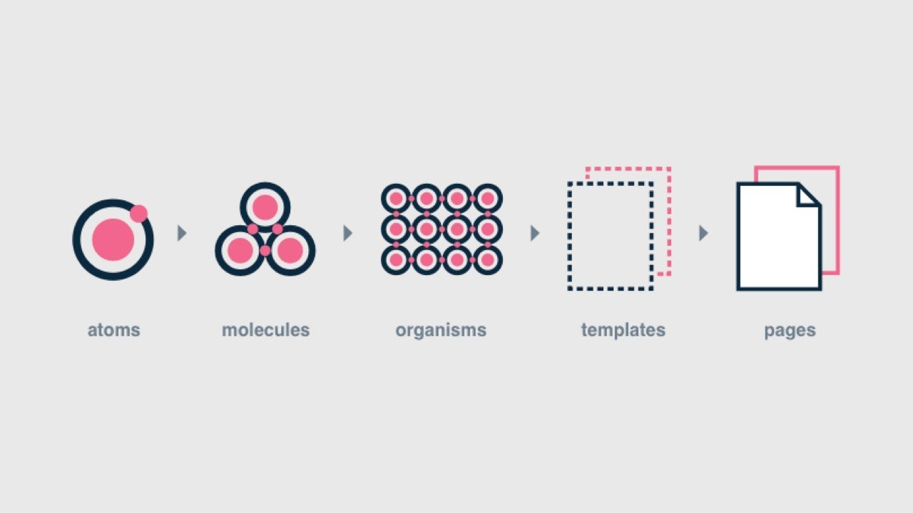

# Folder Structure

Our app structure follows `atomic` design principles. More can be read [here](http://bradfrost.com/blog/post/atomic-web-design/)

**App**

* **Components**: All components will reside here in a structured manner. For further breakdown of component hierarchy please see [here](./Component.md)

* **Constants** The constants which will be used will reside here. Color constants, typography etc.

- **Packages** Custom framework to create a wrapper and writing custom code in lifecycle methods. TODO, need inputs from devs

* **Pages** Pages are specific instances of templates. Here, placeholder content is replaced with real representative content to give an accurate depiction of what a user will ultimately see. Pages are the highest level of fidelity and because they’re the most tangible, it’s typically where most people in the process spend most of their time and what most reviews revolve around. The page stage is essential as it’s where we test the effectiveness of the design system. Viewing everything in context allows us to loop back to modify our molecules, organisms, and templates to better address the real context of the design.

* **Styles** Contains all style related files. Themes, typography, colors, brand level themes etc.

* **Utils** This contains loggers and other utilities.

* **Config**  This will have our configuration files. e.g. Jest config(testing framewok), Environment config etc

* **Mock**  This has all the mock json data.
